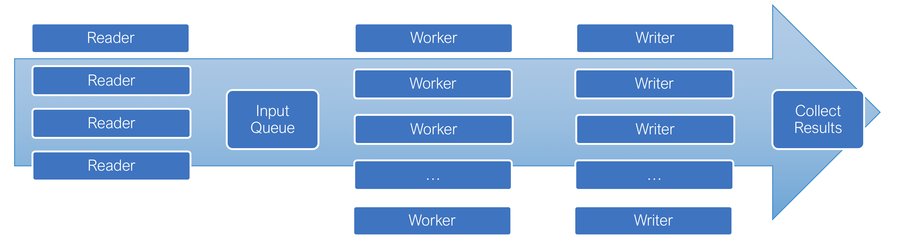

# FASTQ Processing Framework
A `FASTQProcessor` class (in `fastq.processor`) is designed to provide a framework for processing FASTQ files. It implements the logic for reading the file and processing the reads. This framework is capable of processing multiple pairs of FASTQ files for the same sample (for example, Illumina MiniSeq produces 4 pairs of FASTQ files for each sample). A reader process will be used to read and decompress each pair of files. The reads are put into a queue for processing. A number of workers are also started at the same time to process the reads from the queue. The workers are also responsible to compress and write reads into new FASTQ files if needed.

Each reader process may use multiple threads for decompression. The reads are put into an "Input Queue" in batches. By default, there are 5000 read pairs in a batch. A batch is a basic unit of data for processing. Each worker will process one batch of data from the queue at a time. Increasing the batch size can reduces the overhead of accessing the reader queue. However, large batch size may increase the memory usage and decrease the efficiency of each worker. Each worker may also write data into temporary files. Once all worker finished processing, the results are collected and combined.

The [pigz](https://zlib.net/pigz/) tool must be installed in order for the readers to use multiple threads for compression/decompression.

## Worker
The `FASTQProcessor` class must be initialized with a sub-class of `FASTQWorker`. `FASTQWorker` implements the logic of getting batch of read from the queue, unpack and process them. A sub-class will implement the `process_read_pair()` method to process a pair of reads base on the need of the actual application.

By default, the `FASTQProcessor` starts the workers with the same parameters. This can be modified by implementing a sub-class of `FASTQProcessor` and overriding the `get_worker_args()` as well as `get_worker_kwargs()` methods.

## Collecting Results
The `collect_results()` method in `FASTQProcessor` collects the statistics from all workers. Sub-class may override this method to perform additional processing like concatenating the output files.
